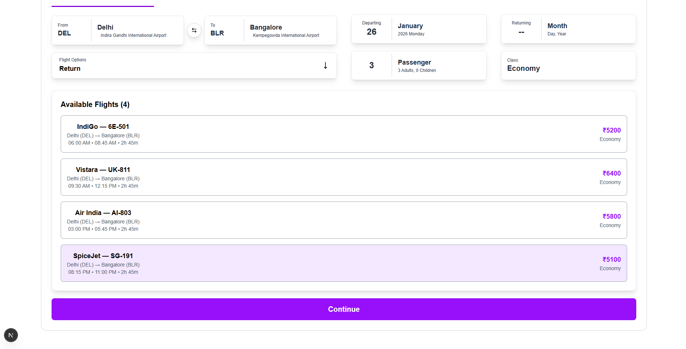

<p align="center">
  
</p>

# Skyward

## Online Airline Ticket Booking Platform

**Skyward** is an online airline ticket booking web application designed to provide users with a clean, intuitive, and engaging flight booking experience.

The platform focuses on simplicity and clarity — allowing users to search flights, compare options, select seats, and manage bookings through a well-structured UI and UX. Skyward is built as a full-stack project to understand real-world backend–frontend interaction using **Spring Boot (Java)** and **Next.js**, while following industry-standard architectural practices.

---

## 📸 Screenshots / Demo

<p align="center">
  
  
</p>

**Authentication & Control Panel**  
Skyward supports secure user signup and login. After authentication, users are redirected to the control panel where they can initiate a flight booking by selecting route, date, and travel class.

<p align="center">
  
  
</p>

**Flight Selection & Booking Flow**  
Available flights are displayed based on the selected route and date. Selecting a flight opens a detailed view where users can see aircraft information, seat availability, pricing, and airport details before confirming the booking.

---

## ✨ Features

### 🔐 Authentication & Account Management
- User signup and login  
- Secure password storage using hashing  
- Session-based authentication  
- Persistent login using frontend cache  

### 🎛️ Flight Booking Control Panel
- Select departure location  
- Select destination  
- Select travel date  
- Choose travel class:
  - Economy  
  - Premium  
  - Business  
- Simple and guided booking flow  

### ✈️ Flight Search & Listing
- Displays available flights for selected route  
- Uses structured dummy flight and airport data  
- Clean list view for easy comparison  

### 🪑 Flight Details & Seat Selection
- Dedicated flight detail screen  
- UI divided into:
  - **Left panel**:
    - Flight code  
    - Departure airport  
    - Destination airport  
  - **Right panel**:
    - Seat availability  
    - Seat selection  
- Total ticket price calculation  
- Continue button to confirm booking  

### 📋 Booking Management
- Successfully booked flights are saved  
- Manage / Booked / Check-in section displays:
  - Booking history  
  - Flight details  
- No payment gateway integrated (current version)  

---

## 🧠 How Skyward Works (High Level)

1. User signs up or logs in  
2. User opens the flight booking control panel  
3. Route, date, and class are selected  
4. Available flights are displayed  
5. User selects a flight and seat  
6. Booking is confirmed  
7. Booking record appears in Manage / Check-in section  

---

## 🏗️ Architecture Overview

Skyward uses a **monolithic backend architecture** built with **Spring Boot**, following the **MVC design pattern**.

```text
Next.js Frontend
      |
      | HTTP Requests
      v
Spring Boot Backend (Java)
      |
      | MVC Architecture
      v
MySQL Database
🛠️ Tech Stack
🌐 Frontend
Next.js

JavaScript

Browser cache for session persistence

☕ Backend
Java

Spring Boot

REST API architecture

MVC design pattern

Monolithic architecture

🗄️ Database
MySQL

User credentials stored with hashed passwords

🔐 Security
Password hashing using Spring Boot Encoder

☁️ Infrastructure & DevOps
Docker (backend containerization)

Render (deployment platform)

⚙️ Setup & Installation (Local)
# Clone repository
git clone <skyward-repo>

# Backend
cd backend
./mvnw spring-boot:run
# or
mvn spring-boot:run

# Frontend
cd ../frontend
npm install
npm run dev
Ensure MySQL is running and environment variables are configured correctly.

🚀 Usage
Create an account and log in

Search flights by route and date

Select flight class and seats

Confirm booking

View bookings in Manage / Check-in section

🧩 Key Design Decisions
Simple booking-first user experience

Monolith architecture for clarity and learning

MVC pattern for clean backend structure

Dummy data usage for controlled behavior

Clear separation of frontend and backend

📈 Scalability & Future Scope
Payment gateway integration

Real-time flight data APIs

Seat availability synchronization

Microservices migration (if required)

Admin panel for airline management

🛣️ Roadmap / Future Improvements
Payment system integration

Ticket cancellation & rescheduling

Email notifications

Role-based admin access

Mobile-first optimization

📄 License
MIT License (to be finalized)

👤 Author
Ravi Sharma
Software Engineer | Full-Stack Developer